# Dự án trực quan hóa thuật toán tìm kiếm cho trò chơi 8-Puzzle

## 0. Chạy nhanh cho sinh viên

App chính của bài nộp là:

- Core thuật toán: `eight_puzzle_search_app.py`
- Giao diện web (Streamlit): `streamlit_eight_puzzle_app.py`
- Package phụ/educational: `8_puzzle_ai/`
- Showcase phụ: `stage3_search_showcase_app.py`

Chạy giao diện web chính:

```powershell
python -m pip install -r requirements.txt
python -m streamlit run .\streamlit_eight_puzzle_app.py
```

Chạy package phụ/educational nếu cần đối chiếu thêm:

```powershell
python -m streamlit run .\8_puzzle_ai\app.py
```

Chạy showcase phụ:

```powershell
python -m streamlit run .\stage3_search_showcase_app.py
```

Ghi chú về desktop/Tkinter: bản workspace hiện tại không có `eight_puzzle_tk_app.py`
hoặc package `eight_puzzle_tk/`. Vì vậy tài liệu nộp bài ưu tiên bản Streamlit chính
và không yêu cầu chạy app desktop.

Các chế độ demo trong Streamlit chính:

- `8-Puzzle Search`: chọn Start/Goal, thuật toán, heuristic, trace, experiment và report.
- `Trò chơi xếp hình từ ảnh`: board số chơi được ngay; tải ảnh để đổi 8 ô thành mảnh ảnh, hỗ trợ Undo/Reset/Shuffle và chỉ đổi Start solver khi bấm `Dùng làm trạng thái bắt đầu`.

Mỗi thuật toán trong 6 nhóm có một GIF chạy thật ngay tại vùng chọn thuật toán. GIF được sinh từ
chính `run_algorithm` với Start/heuristic/seed cố định, không phải minh họa giả.

### GIF demo trực tiếp cho từng thuật toán

Bảng dưới đây nhúng trực tiếp các GIF đang nằm trong repo tại `web/assets/algorithm-demos/`.
Mỗi GIF được sinh từ một lần chạy core thật, nên khi mở README trên GitHub người chấm có thể thấy ngay
từng thuật toán đang chạy.

| Nhóm | Thuật toán | GIF chạy thật |
|---|---|---|
| Uninformed Search | BFS |  |
| Uninformed Search | DFS | 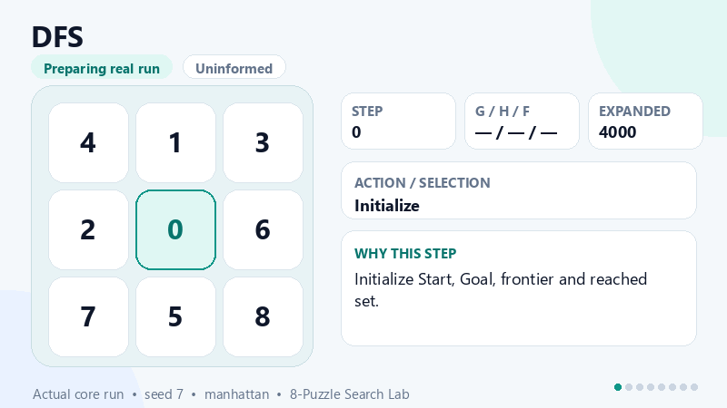 |
| Uninformed Search | UCS | 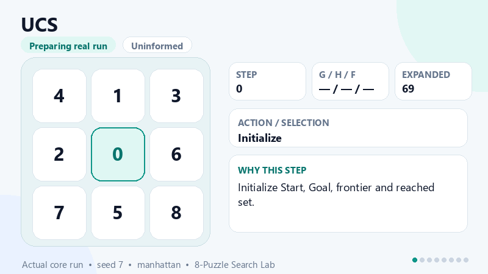 |
| Uninformed Search | IDS | 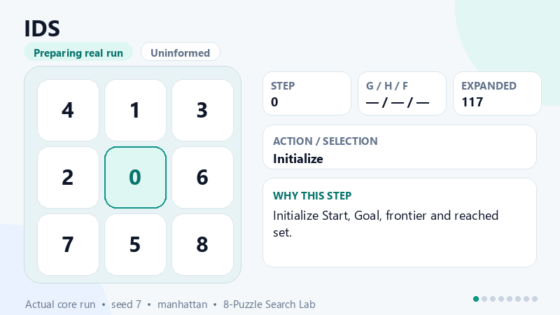 |
| Informed Search | Greedy | 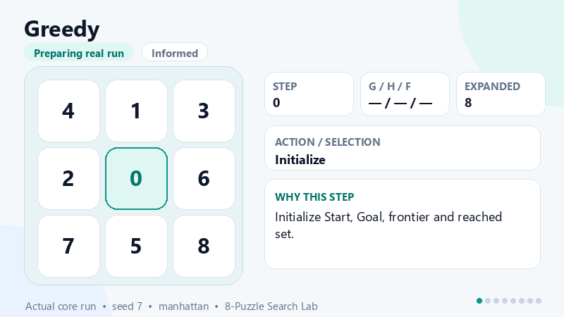 |
| Informed Search | A* | 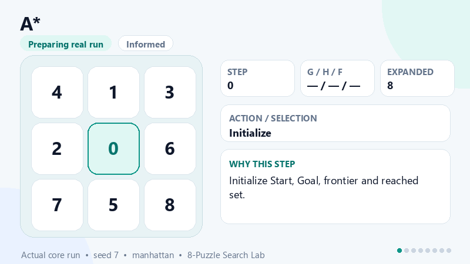 |
| Informed Search | IDA* | 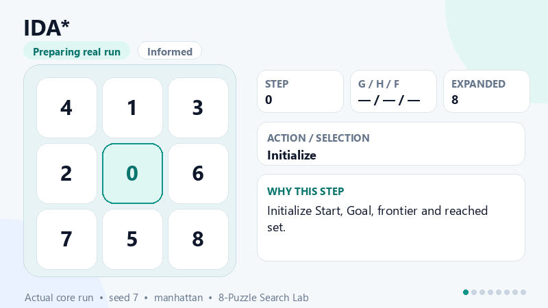 |
| Local Search | Simple Hill Climbing | 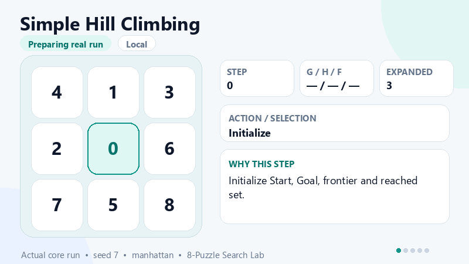 |
| Local Search | Steepest-Ascent Hill Climbing |  |
| Local Search | Stochastic Hill Climbing | 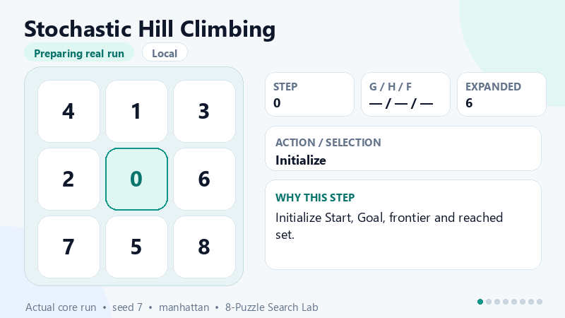 |
| Local Search | Random-Restart Hill Climbing | 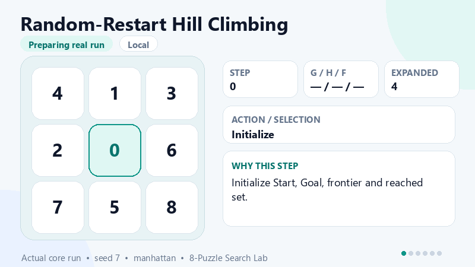 |
| Local Search | Local Beam Search | 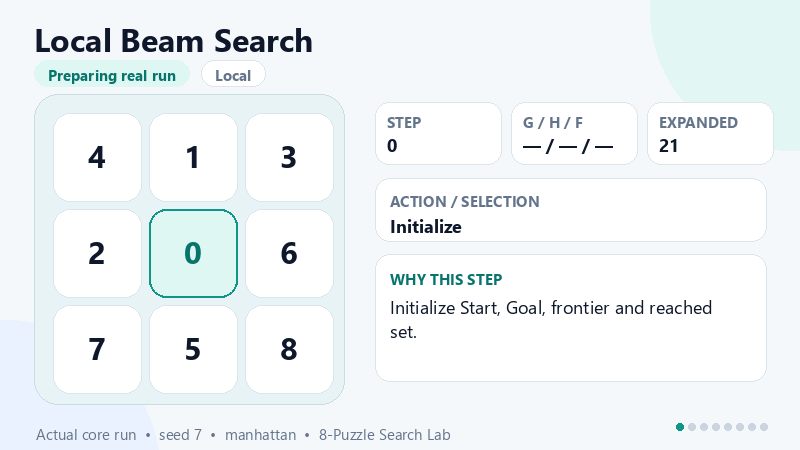 |
| Local Search | Simulated Annealing | 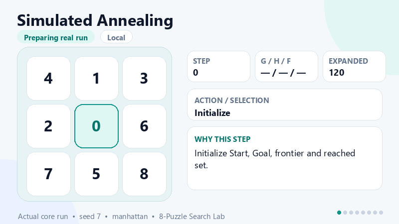 |
| Complex Environments | AND-OR Search | 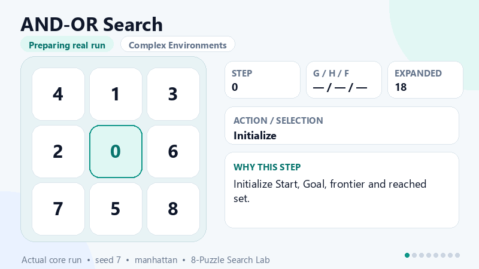 |
| Complex Environments | No Observation Search | 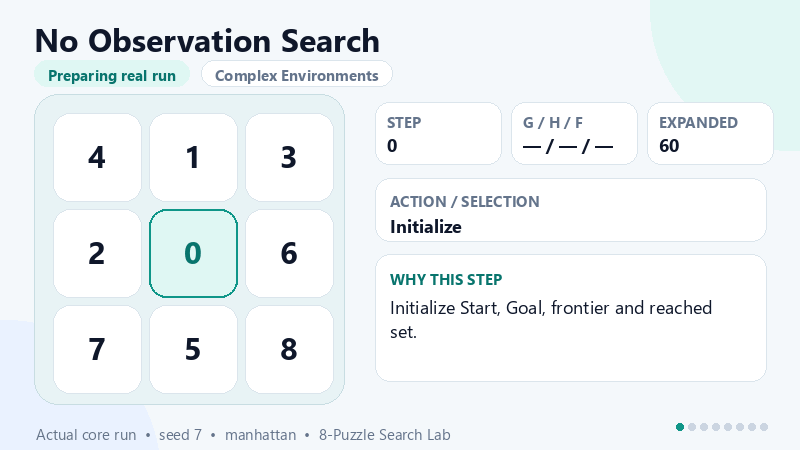 |
| Complex Environments | Partially Observable Search | 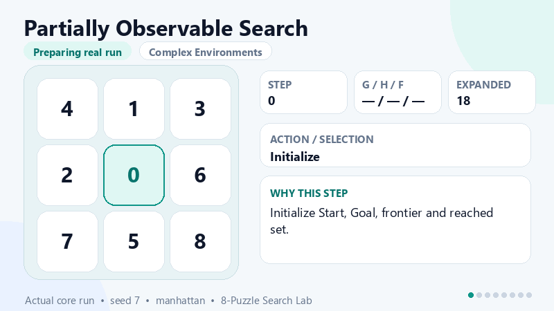 |
| Complex Environments | Online Search | 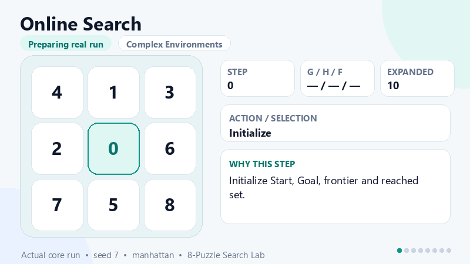 |
| Constraint Satisfaction Problems | CSP Definition | 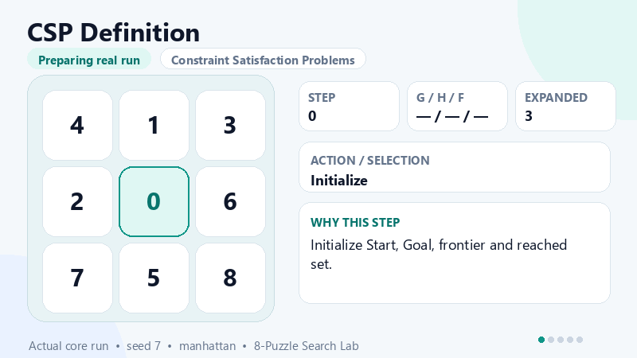 |
| Constraint Satisfaction Problems | Constraint Propagation | 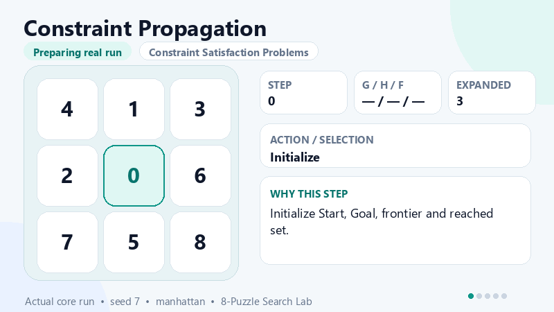 |
| Constraint Satisfaction Problems | Path Consistency | 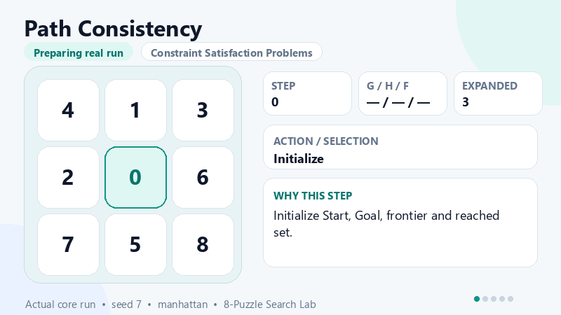 |
| Constraint Satisfaction Problems | Global Constraints | 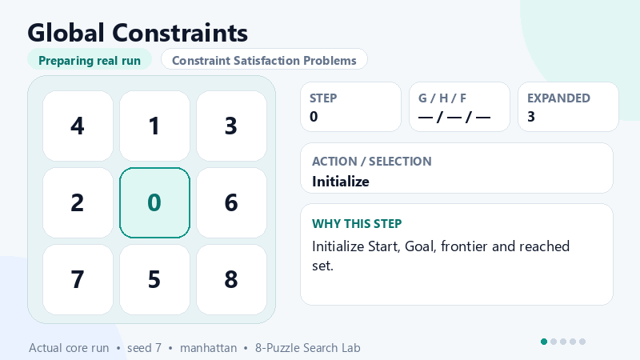 |
| Constraint Satisfaction Problems | CSP Backtracking | 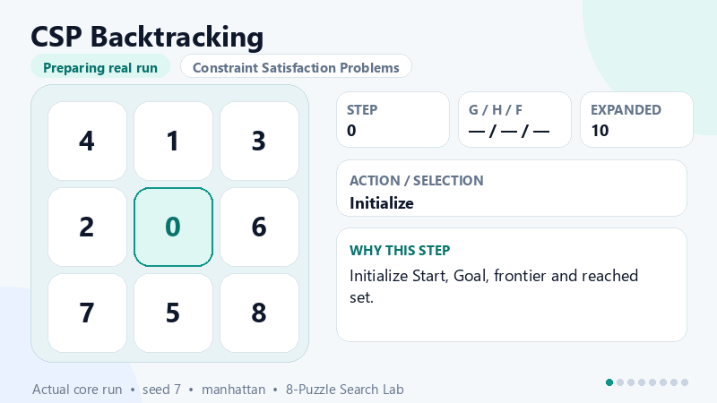 |
| Constraint Satisfaction Problems | Min-Conflicts | 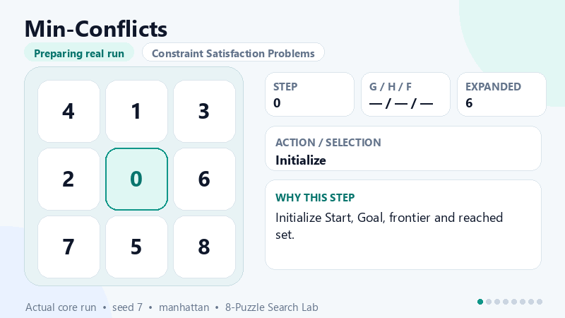 |
| Adversarial / Stochastic Search | Minimax | 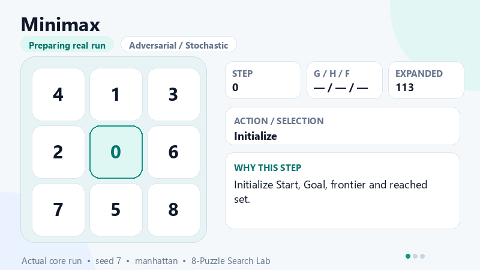 |
| Adversarial / Stochastic Search | Alpha-Beta Pruning | 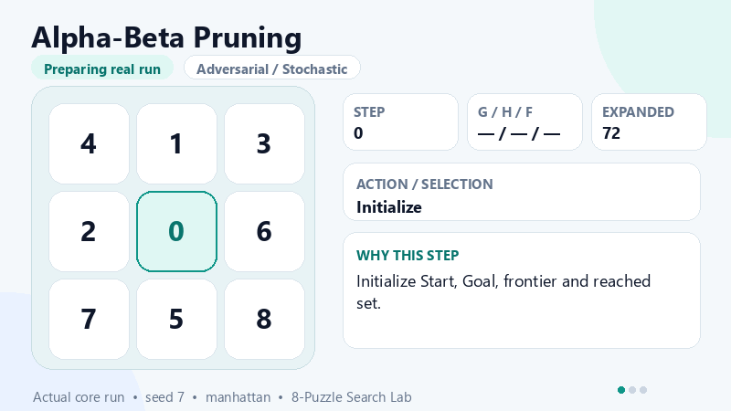 |
| Adversarial / Stochastic Search | Expectimax | 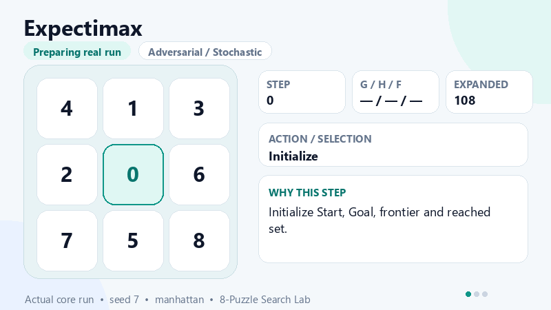 |

Tạo lại toàn bộ 26 GIF:

```powershell
python .\scripts\generate-algorithm-demo-gifs.py
```

`Chạy thuật toán đã chọn` và `So sánh nhóm đang chọn` luôn dùng đúng ma trận Start đang hiển thị.
Muốn tạo bài mới, người dùng chủ động bấm `Tự trộn ma trận`. Kết quả lời giải và trace đều có
điều khiển Bước trước/Bước sau/Về đầu, Play/Pause, tốc độ phát và slider chọn bước.

Chạy kiểm thử trước khi nộp:

```powershell
python -m py_compile .\eight_puzzle_search_app.py .\streamlit_eight_puzzle_app.py .\stage3_search_showcase_app.py .\8_puzzle_ai\app.py
python .\eight_puzzle_search_app.py --self-test
python .\tests\test_search_behavior.py
python .\tests\test_streamlit_constraint_graph_routing.py
python .\8_puzzle_ai\tests\test_puzzle.py
```

Phạm vi heuristic `h(n)` của app chính được cố ý giữ đúng hai hàm cơ bản trong môn học:

- `misplaced`: số ô sai vị trí so với Goal.
- `manhattan`: tổng khoảng cách Manhattan của từng ô tới Goal.

Các nhóm `Complex Environments`, `Constraint Satisfaction Problems` và
`Adversarial / Stochastic Search` được gắn nhãn là mô hình học thuật/educational.
Chúng giúp chứng minh hiểu đúng dạng bài toán, PEAS, biến/ràng buộc, belief state,
đối thủ hoặc chance node. Riêng nhóm đối kháng/xác suất dùng Caro mini-game
vì 8-puzzle chuẩn không có đối thủ; không được trình bày như solver chuẩn thay thế BFS/UCS/A*.

Checklist nộp bài:

- [ ] App chính chạy được bằng Streamlit.
- [ ] Có đủ 6 nhóm thuật toán trong UI.
- [ ] Cả 26 thuật toán có GIF chạy thật tương ứng trong UI.
- [ ] Mỗi thuật toán có PEAS và dạng bài toán tương ứng.
- [ ] Trace thể hiện rõ `Node`, `Frontier`, `Reached`, `Priority Rule`, `Selection Key`.
- [ ] Heuristic trong UI chỉ có `misplaced` và `manhattan`.
- [ ] A* + Manhattan giải được preset demo và có certificate hợp lệ.
- [ ] Unsolvable state dừng sớm, không mở rộng node.
- [ ] Có thể xuất Markdown/DOCX/PDF/HTML/CSV trong tab `Report`.
- [ ] Tất cả lệnh kiểm thử phía trên pass trước khi nộp.

Kịch bản demo chi tiết nằm ở `docs/demo_script.md`.

## 0.1. Tổng quan chuyên nghiệp cho người đọc/chấm bài

Dự án này không chỉ là một game 8-puzzle. Đây là một **phòng thí nghiệm trực quan cho bài toán tìm kiếm trong AI**:

1. Người học chọn trạng thái Start/Goal và thuật toán.
2. Chương trình chạy solver hoặc demo học thuật tương ứng.
3. UI hiển thị lời giải, certificate, bảng `Node / Frontier / Reached`, cây tìm kiếm, heuristic inspector và report xuất file.
4. Người đọc có thể so sánh thuật toán theo chi phí đường đi, số node mở rộng, số node sinh ra, frontier lớn nhất, runtime và tính tối ưu.

Điểm cần phân biệt khi trình bày:

- **8-Puzzle Search** là bài toán chính: deterministic, fully observable, single-agent, chi phí mỗi bước bằng `1`.
- **Complex Environments** là nhóm mô phỏng mở rộng: belief state, partial observation, online learning.
- **Constraint Satisfaction Problems** là nhóm CSP: mô hình hóa 8-puzzle bằng biến, miền giá trị, ràng buộc và planning horizon.
- **Adversarial / Stochastic Search** dùng **Caro mini-game** vì 8-puzzle chuẩn không có đối thủ. Nhóm này minh họa MAX, MIN, alpha-beta và chance node đúng bản chất học thuật.

## 0.2. Cấu trúc repo chi tiết

```text
.
├── README.md
│   └── Tài liệu chính: mục tiêu, cách chạy, cấu trúc, lý thuyết, thuật toán, trace, kiểm thử.
├── requirements.txt
│   └── Dependency tối thiểu cho Streamlit/Pandas và các phần xuất báo cáo.
├── eight_puzzle_search_app.py
│   ├── Core state-space 8-puzzle: parse state, validate state, solvability, neighbors.
│   ├── Heuristic: misplaced tiles, Manhattan distance, helper giải thích h(n).
│   ├── Solver chuẩn: BFS, DFS, UCS, IDS, Greedy, A*, IDA*, local search.
│   ├── Demo học thuật: complex environment, CSP, adversarial/stochastic.
│   ├── Trace engine: Node, Action, g, h, f, Frontier, Reached, Selection Key.
│   ├── Certificate: kiểm tra path hợp lệ, goal đúng, cost đúng, unsolvable dừng sớm.
│   └── Export: Markdown, DOCX, PDF, HTML, CSV benchmark.
├── streamlit_eight_puzzle_app.py
│   └── Entry point UI Streamlit chính, điều phối sidebar, run button, tabs và session state.
├── web/
│   ├── algorithm_demo_assets.py
│   │   └── Ánh xạ tên thuật toán sang GIF và render GIF đang chọn trong Streamlit.
│   ├── assets/algorithm-demos/
│   │   └── 26 GIF được sinh từ kết quả chạy core thật với cấu hình demo cố định.
│   ├── ui_views.py
│   │   └── Component UI: board, trace replay, heuristic inspector, report tab, path playback.
│   ├── ui_text.py
│   │   └── Toàn bộ nhãn song ngữ Tiếng Việt/English và bảng học thuật.
│   ├── ui_theme.py
│   │   └── Inject CSS theme.
│   └── ui-theme.css
│       └── Design tokens, layout, board tiles, trace cards, dataframe styling.
├── scripts/
│   └── generate-algorithm-demo-gifs.py
│       └── Chạy toàn bộ thuật toán và dựng lại GIF demo xác định bằng Pillow.
├── stage3_search_showcase_app.py
│   └── Showcase phụ cho trực quan hóa thuật toán.
├── 8_puzzle_ai/
│   ├── app.py
│   │   └── Streamlit app phụ để đối chiếu package educational.
│   ├── core/
│   │   └── Node, PuzzleState, heuristic, metrics, utility format ma trận.
│   ├── algorithms/
│   │   └── Các module thuật toán tách theo nhóm: uninformed, informed, local, csp, complex, adversarial.
│   └── tests/
│       └── Test package phụ.
├── tests/
│   ├── test_search_behavior.py
│   │   └── Regression test cho solver chính, trace, report, 6 nhóm thuật toán, Caro, CSP.
│   └── test_streamlit_constraint_graph_routing.py
│       └── Test routing UI, Start cố định và điều khiển playback từng bước.
└── docs/
    ├── demo_script.md
    │   └── Kịch bản thuyết trình/demo.
    └── stage3_showcase.md
        └── Tài liệu showcase phụ.
```

## 0.3. Bản đồ học thuật 6 nhóm thuật toán

| Nhóm | Thuật toán | Dùng để chứng minh | Cách hoạt động ngắn gọn | Kết quả kỳ vọng |
|---|---|---|---|---|
| Uninformed Search | BFS | Tìm kiếm theo tầng | Dùng FIFO frontier, mở node nông nhất trước | Complete, optimal nếu cost đều bằng 1 |
| Uninformed Search | DFS | Tìm kiếm theo nhánh sâu | Dùng stack LIFO, đi sâu trước rồi quay lui | Ít bộ nhớ hơn, không bảo đảm optimal |
| Uninformed Search | UCS | Tối ưu theo chi phí thật | Priority queue theo `g(n)` nhỏ nhất | Complete, optimal với cost không âm |
| Uninformed Search | IDS | BFS bằng nhiều lượt DFS giới hạn | Tăng dần depth limit, mỗi lượt chạy depth-limited search | Complete và optimal theo số bước khi limit đủ |
| Informed Search | Greedy | Ưu tiên heuristic | Priority queue theo `h(n)` nhỏ nhất | Thường nhanh, không bảo đảm optimal |
| Informed Search | A* | Cân bằng cost thật và ước lượng | Priority queue theo `f(n)=g(n)+h(n)` | Optimal nếu heuristic admissible |
| Informed Search | IDA* | A* tiết kiệm bộ nhớ | DFS có ngưỡng `f`, tăng threshold dần | Optimal nếu heuristic admissible và bound đủ |
| Local Search | Simple Hill Climbing | Tìm kiếm cục bộ đơn giản | Chọn láng giềng đầu tiên làm giảm `h(n)` | Nhanh, dễ kẹt local optimum |
| Local Search | Steepest-Ascent Hill Climbing | Chọn cải thiện tốt nhất | Xét toàn bộ neighbor rồi chọn `h(n)` thấp nhất | Tốt hơn simple, vẫn không complete |
| Local Search | Stochastic Hill Climbing | Vai trò ngẫu nhiên | Chọn ngẫu nhiên trong các neighbor cải thiện | Có thể thoát vài hướng xấu, phụ thuộc seed |
| Local Search | Random-Restart Hill Climbing | Giảm rủi ro kẹt | Chạy nhiều lần từ điểm restart và giữ trạng thái tốt nhất | Cải thiện xác suất tìm goal |
| Local Search | Local Beam Search | Nhiều trạng thái song song | Giữ `k` candidate tốt nhất theo `h(n)` mỗi vòng | Khám phá rộng hơn hill climbing |
| Local Search | Simulated Annealing | Chấp nhận bước xấu có kiểm soát | Có thể nhận neighbor tệ hơn theo nhiệt độ `T` giảm dần | Giúp tránh kẹt sớm, không bảo đảm optimal |
| Complex Environments | AND-OR Search | Môi trường nondeterministic | Tạo conditional-plan trace với OR choice và AND outcome | Demo chính sách điều kiện, không phải solver chuẩn |
| Complex Environments | No Observation Search | Belief state không quan sát | Một action áp vào nhiều possible worlds trong belief frontier | Minh họa agent không biết state thật |
| Complex Environments | Partially Observable Search | Quan sát một phần | Lọc belief bằng quan sát vị trí blank/ô lân cận | Minh họa partial observation và belief update |
| Complex Environments | Online Search | Agent học khi di chuyển | LRTA* cập nhật learned heuristic khi khám phá map | Minh họa online learning/search |
| Constraint Satisfaction Problems | CSP Definition | Mô hình biến/miền/ràng buộc | Trình bày state như assignment thỏa constraints | Chứng minh hiểu CSP formulation |
| Constraint Satisfaction Problems | Constraint Propagation | Lan truyền ràng buộc | Thu hẹp domain bằng constraint inference | Giảm search space |
| Constraint Satisfaction Problems | Path Consistency | Kiểm tra nhất quán đường | Xem các cặp/đường ràng buộc để loại domain không hợp | Minh họa consistency mạnh hơn arc check |
| Constraint Satisfaction Problems | Global Constraints | Ràng buộc toàn cục | Áp dụng constraint trên nhiều biến cùng lúc | Minh họa all-different/aggregate constraint |
| Constraint Satisfaction Problems | CSP Backtracking | Tìm assignment hợp lệ | Gán biến, kiểm tra constraint, quay lui khi conflict | Complete nếu search đủ |
| Constraint Satisfaction Problems | Min-Conflicts | Local search cho CSP | Sửa biến gây conflict để giảm số xung đột | Tốt cho CSP lớn, không luôn complete |
| Adversarial / Stochastic Search | Minimax | Đối kháng MAX/MIN | MAX chọn nước tối đa utility, MIN chọn nước giảm utility | Optimal trong game tree bị giới hạn |
| Adversarial / Stochastic Search | Alpha-Beta Pruning | Cắt nhánh minimax | Bỏ nhánh không thể ảnh hưởng quyết định cuối | Cùng giá trị minimax, ít node hơn |
| Adversarial / Stochastic Search | Expectimax | Chance node/xác suất | MAX tối đa expected value khi đối thủ/chance ngẫu nhiên | Chọn nước có kỳ vọng tốt nhất |

## 0.4. Chuẩn đọc trace Node / Frontier / Reached

Mỗi dòng trace là một vòng quyết định của thuật toán.

| Cột | Ý nghĩa khi thuyết trình |
|---|---|
| `Node` | Ma trận đang được chọn để xét/mở rộng ở vòng hiện tại. |
| `Action` | Hướng đi tạo ra node hiện tại từ parent. |
| `g` | Chi phí thật từ Start tới node hiện tại. |
| `h` | Heuristic: `misplaced` hoặc `manhattan`. |
| `f` | Hàm ưu tiên, thường là `g+h` với A*. |
| `Priority Rule` | Quy tắc chọn node của thuật toán. |
| `Selection Key` | Giá trị cụ thể khiến node này được chọn, ví dụ `f=4; g=2; h=2`. |
| `Generated Children` | Số successor hợp lệ được sinh ra từ node hiện tại. |
| `Skipped States` | Số state bị bỏ qua vì đã reached, nằm trên path, hoặc bị limit/prune. |
| `Frontier` | Các node đang chờ mở rộng sau khi expand node hiện tại. Mỗi entry hiển thị dạng `(Node, Hướng đi, Số ô sai hoặc Manhattan)`. |
| `Reached` | Các state đã ghi nhận để tránh lặp hoặc so sánh cost tốt hơn. |
| `Decision/Note` | Diễn giải ngắn vì sao thuật toán làm bước đó. |

Ví dụ Frontier sau khi A* mở rộng một node:

```text
(Node:
1 2 3
4 5 6
7 8 0
Hướng đi: Right
Số ô sai hoặc Manhattan: 0)
```

Khi báo cáo, có thể đọc là: “Frontier đang giữ node ứng viên này; nó được tạo bởi hướng đi `Right`; giá trị heuristic hiện tại bằng `0`, nên nếu dùng A* thì `f=g+h` sẽ quyết định thứ tự ưu tiên.”

## 1. Thông tin dự án

**Tên dự án:** Trực quan hóa và so sánh các thuật toán tìm kiếm trên bài toán 8-Puzzle  
**Lĩnh vực:** Trí tuệ nhân tạo, tìm kiếm trong không gian trạng thái, heuristic search  
**Ngôn ngữ lập trình:** Python  
**Giao diện:** Streamlit, có hỗ trợ Tiếng Việt và English  
**Ngày tạo dự án:** 04/06/2026  

## 2. Mục tiêu của dự án

Dự án này xây dựng một chương trình mô phỏng trò chơi **8-Puzzle** nhằm minh họa cách các thuật toán tìm kiếm hoạt động trong trí tuệ nhân tạo.

Chương trình tập trung vào ba mục tiêu chính:

1. **Trực quan hóa quá trình tìm kiếm:** hiển thị trạng thái hiện tại, frontier, reached và các bước mở rộng node.
2. **So sánh thuật toán:** so sánh số bước lời giải, số node mở rộng, số node sinh ra, kích thước frontier, thời gian chạy và tính tối ưu.
3. **Phục vụ học thuật:** giải thích mô hình bài toán, hàm đánh giá `g(n)`, `h(n)`, `f(n)`, tính đầy đủ, tính tối ưu và hạn chế của từng thuật toán.

## 3. Bài toán 8-Puzzle

8-Puzzle là một bài toán kinh điển trong trí tuệ nhân tạo. Bàn cờ gồm 9 ô dạng ma trận `3 x 3`, trong đó có 8 ô số từ `1` đến `8` và một ô trống được ký hiệu là `0`.

Ví dụ trạng thái bắt đầu:

```text
1 2 3
4 5 6
0 7 8
```

Trạng thái đích mặc định:

```text
1 2 3
4 5 6
7 8 0
```

Mục tiêu là tìm một chuỗi hành động hợp lệ để biến trạng thái bắt đầu thành trạng thái đích.

### 3.1. Biểu diễn trạng thái

Trong mã nguồn, mỗi trạng thái được biểu diễn bằng tuple gồm 9 số:

```python
(1, 2, 3, 4, 5, 6, 7, 8, 0)
```

Ma trận tương ứng:

```text
1 2 3
4 5 6
7 8 0
```

### 3.2. Tập hành động

Ô trống `0` có thể di chuyển theo bốn hướng nếu hợp lệ:

| Hành động | Ý nghĩa |
|---|---|
| `Up` | Di chuyển ô trống lên trên |
| `Down` | Di chuyển ô trống xuống dưới |
| `Left` | Di chuyển ô trống sang trái |
| `Right` | Di chuyển ô trống sang phải |

Mỗi hành động có chi phí bằng `1`, vì vậy chi phí đường đi `g(n)` chính là số bước từ trạng thái bắt đầu đến node hiện tại.

### 3.3. Điều kiện solvable

Không phải mọi hoán vị của 8-Puzzle đều có lời giải. Với bàn `3 x 3`, trạng thái có thể giải được nếu số inversion có cùng parity với trạng thái đích.

Trong chương trình:

- `generate_random_state()` tạo trạng thái bằng cách đi ngẫu nhiên từ goal, nên luôn solvable.
- Nếu nhập một trạng thái không solvable, thuật toán sẽ dừng sớm và báo lỗi thay vì tìm kiếm vô hạn.

### 3.4. PEAS cho 8-Puzzle Agent

| Thành phần | Xác định trong dự án |
|---|---|
| Performance | Đạt Goal, tối thiểu hóa số bước/cost, giảm node expanded/generated, chạy trong giới hạn thời gian/bộ nhớ, có trace và certificate hợp lệ. |
| Environment | Bảng 3x3 deterministic, fully observable, một ô trống `0`, hành động hợp lệ `Up/Down/Left/Right`, cost mỗi bước bằng `1`, solvability theo inversion parity. |
| Actuators | Di chuyển ô trống theo `Up`, `Down`, `Left`, `Right` nếu hợp lệ. |
| Sensors | Quan sát toàn bộ ma trận 3x3, vị trí ô trống, tập hành động hợp lệ và kiểm tra Goal. |

## 4. Cấu trúc dự án

### 4.0. Đường chạy chính

Phiên bản chính cần chạy và demo là:

- Core thuật toán: `eight_puzzle_search_app.py`
- Giao diện Streamlit chính: `streamlit_eight_puzzle_app.py`
- Lệnh chạy khuyến nghị: `python -m streamlit run .\streamlit_eight_puzzle_app.py`

Thư mục `8_puzzle_ai/` là package phụ phục vụ tham khảo và minh họa thêm. Các nhóm `Complex Environments`, `Constraint Satisfaction` và `Adversarial Search` trong package này là demo học thuật, không phải solver tự nhiên của bài toán 8-Puzzle chuẩn.

```text
D:\Trí tuệ nhân tạo
├── eight_puzzle_search_app.py
├── streamlit_eight_puzzle_app.py
└── README.md
```

### 4.1. `eight_puzzle_search_app.py`

File lõi chứa:

- Biểu diễn trạng thái 8-Puzzle.
- Sinh trạng thái random solvable.
- Kiểm tra solvability.
- Các heuristic.
- Các thuật toán tìm kiếm.
- Thu thập trace `Node / Frontier / Reached` kèm `Priority Rule`, `Selection Key`, số child sinh ra và số state bị bỏ qua.
- Kiểm chứng kết quả bằng `validate_result()`.
- Giải thích heuristic bằng `explain_heuristic()`: hai h(n) chính của bài là `misplaced` và `manhattan`, kèm đóng góp từng ô.
- Giải thích từng bước trace bằng `build_trace_story()`, giúp trả lời câu hỏi “vì sao node này được chọn?”.
- Chạy benchmark coursework bằng `run_experiment_suite()` và xuất bảng bằng `export_experiment_markdown()`.
- Xuất báo cáo Markdown/DOCX/PDF/HTML/CSV bằng submission pack, có PEAS, certificate, heuristic inspector, trace story và experiment summary nếu đã chạy.
- Hàm so sánh thuật toán.
- Self-test.
- Hàm `launch_jupyter_app()` cho môi trường Jupyter nếu có `ipywidgets`.

### 4.2. `streamlit_eight_puzzle_app.py`

File giao diện web Streamlit chứa:

- Giao diện song ngữ Tiếng Việt / English.
- Ma trận Start và Goal dạng lưới 3x3 xếp dọc, không có header cột, dễ quan sát và không bị chồng lấn.
- Nút tự trộn ma trận.
- Chọn thuật toán, heuristic và các giới hạn chạy.
- Chọn nhóm thuật toán theo 6 nhóm học thuật rồi chọn thuật toán trong nhóm.
- Chọn preset demo cố định: `easy_2`, `medium_10`, `hard_20`, `unsolvable_demo`.
- Phần cơ sở học thuật, bao gồm PEAS cho 8-Puzzle agent.
- Bảng tổng kết.
- Algorithm Certificate cho mỗi lần chạy.
- Bảng lời giải.
- Bảng trace `Node / Frontier / Reached`.
- Bảng so sánh thuật toán.
- Tab `Heuristics` để xem h(n) theo `misplaced` và `manhattan`, kèm đóng góp từng ô.
- Tab `Experiment` để chạy benchmark deterministic trên preset cố định.
- Tab `Report` để tải báo cáo Markdown phục vụ nộp bài.

## 5. Cách chạy chương trình

### 5.1. Chạy giao diện Streamlit

```powershell
python -m streamlit run .\streamlit_eight_puzzle_app.py
```

Sau khi chạy, mở:

```text
http://127.0.0.1:8501
```

### 5.2. Chạy demo bằng terminal

```powershell
python .\eight_puzzle_search_app.py --demo
```

### 5.3. Chạy self-test

```powershell
python .\eight_puzzle_search_app.py --self-test
```

Nếu thành công, chương trình in:

```text
Self-test passed.
```

### 5.4. Dùng trong Jupyter

```python
from eight_puzzle_search_app import launch_jupyter_app
launch_jupyter_app()
```

Nếu môi trường thiếu `ipywidgets`, chương trình sẽ tự fallback sang demo dạng text.

## 6. Các khái niệm học thuật trong chương trình

### 6.1. Node

`Node` là trạng thái đang được thuật toán chọn để xét tại vòng lặp hiện tại.

Một node thường chứa:

- `state`: trạng thái ma trận.
- `parent`: node cha.
- `action`: hành động tạo ra node.
- `g(n)`: chi phí từ start đến node.
- `h(n)`: heuristic ước lượng từ node đến goal.
- `f(n)`: hàm đánh giá dùng để ưu tiên node.
- `depth`: độ sâu trong cây tìm kiếm.

### 6.2. Frontier

`Frontier` là tập các node đã được sinh ra nhưng chưa được mở rộng.

Tùy thuật toán, frontier có thể là:

| Thuật toán | Frontier |
|---|---|
| BFS | Hàng đợi FIFO |
| DFS | Stack LIFO |
| UCS | Priority queue theo `g(n)` |
| Greedy | Priority queue theo `h(n)` |
| A* | Priority queue theo `f(n)=g(n)+h(n)` |
| IDS | Stack trong từng lần depth-limited search |
| IDA* | Đường DFS hiện tại với ngưỡng `f` |
| Hill Climbing | Danh sách láng giềng |
| Local Beam Search | Tập beam/candidate |

### 6.3. Reached

`Reached` là tập các trạng thái đã được ghi nhận để:

- tránh lặp vô hạn;
- không mở lại trạng thái kém hơn;
- theo dõi toàn bộ vùng không gian trạng thái đã đi qua.

### 6.4. Expanded

`Expanded` là số node đã được lấy ra khỏi frontier để kiểm tra và sinh successor.

### 6.5. Generated

`Generated` là số node successor được tạo ra trong quá trình chạy thuật toán.

### 6.6. Complete

Một thuật toán gọi là **complete** nếu nó đảm bảo tìm được nghiệm khi nghiệm tồn tại.

### 6.7. Optimal

Một thuật toán gọi là **optimal** nếu nó đảm bảo trả về nghiệm có chi phí nhỏ nhất.

Với 8-Puzzle trong dự án này, chi phí mỗi bước bằng `1`, nên nghiệm tối ưu là nghiệm có số bước ít nhất.

### 6.8. Thuật toán dựa trên `g(n)`, `h(n)` hay `f(n)`

Để nhìn theo đúng góc độ học thuật, mỗi thuật toán trong dự án được phân loại theo thành phần mà nó dùng để ưu tiên node.

Ý nghĩa các hàm:

| Ký hiệu | Ý nghĩa |
|---|---|
| `g(n)` | Chi phí thật từ trạng thái bắt đầu đến node `n` |
| `h(n)` | Chi phí ước lượng từ node `n` đến goal |
| `f(n)` | Hàm đánh giá tổng hợp để xếp ưu tiên node |

Với A* và IDA*:

```text
f(n) = g(n) + h(n)
```

Bảng phân loại thuật toán theo hàm đánh giá:

| Thuật toán | Dựa chính trên | Dùng `g(n)` | Dùng `h(n)` | Dùng `f(n)` | Diễn giải học thuật |
|---|---|---:|---:|---:|---|
| BFS | Độ sâu / số tầng | Gián tiếp | Không | Không | Với cost mỗi bước bằng 1, độ sâu tương đương `g(n)`, nhưng BFS không tính priority bằng `g(n)` |
| DFS | Stack LIFO / độ sâu nhánh | Không | Không | Không | DFS chọn node mới nhất trong stack, không dựa vào cost hay heuristic |
| UCS | `g(n)` | Có | Không | Gián tiếp | UCS chọn node có chi phí đường đi nhỏ nhất; có thể xem `f(n)=g(n)` |
| IDS | Depth limit | Gián tiếp | Không | Không | IDS kiểm soát độ sâu theo từng vòng lặp; depth tương đương `g(n)` khi cost=1 |
| Greedy | `h(n)` | Không | Có | Gián tiếp | Greedy chỉ nhìn khoảng cách ước lượng tới goal; có thể xem `f(n)=h(n)` |
| A* | `f(n)=g(n)+h(n)` | Có | Có | Có | A* cân bằng chi phí đã đi và chi phí ước lượng còn lại |
| IDA* | `f(n)=g(n)+h(n)` với threshold | Có | Có | Có | IDA* dùng `f(n)` để cắt nhánh theo ngưỡng tăng dần |
| Simple Hill Climbing | `h(n)` | Không | Có | Không | Chọn neighbor đầu tiên làm giảm heuristic |
| Steepest-Ascent Hill Climbing | `h(n)` | Không | Có | Không | Chọn neighbor có heuristic tốt nhất |
| Stochastic Hill Climbing | `h(n)` + ngẫu nhiên | Không | Có | Không | Chọn ngẫu nhiên trong các neighbor có cải thiện heuristic |
| Random-Restart Hill Climbing | `h(n)` qua nhiều restart | Không | Có | Không | Chạy nhiều lần leo đồi để giảm nguy cơ kẹt local optimum |
| Local Beam Search | `h(n)` trên beam | Không | Có | Không | Giữ `k` trạng thái có heuristic tốt nhất ở mỗi vòng |

Trong giao diện Streamlit, phần **Hồ sơ thuật toán đang chọn / Selected algorithm profile** cũng hiển thị bảng riêng:

```text
Component | Có dùng? | Ý nghĩa trong thuật toán đang chọn
g(n)      | ...      | ...
h(n)      | ...      | ...
f(n)      | ...      | ...
```

Nhờ vậy người xem có thể xác định ngay thuật toán đang chạy thuộc kiểu:

- tìm kiếm không heuristic;
- tìm kiếm theo chi phí `g(n)`;
- tìm kiếm heuristic `h(n)`;
- tìm kiếm tổng hợp `f(n)=g(n)+h(n)`;
- hoặc tìm kiếm cục bộ tối thiểu hóa `h(n)`.

## 7. Heuristic sử dụng trong dự án

### 7.1. Manhattan Distance

Manhattan Distance tính tổng khoảng cách hàng và cột của từng ô so với vị trí goal.

Công thức:

```text
h(s) = Σ |row_s(t) - row_g(t)| + |col_s(t) - col_g(t)|
```

Trong đó `t` chạy từ `1` đến `8`, không tính ô trống `0`.

Ví dụ:

- Nếu một ô lệch 1 hàng và 2 cột, đóng góp heuristic là `3`.
- Tổng của tất cả ô là `h(s)`.

Manhattan là heuristic **admissible** cho 8-Puzzle vì nó không bao giờ ước lượng vượt quá số bước thật cần thiết.

### 7.2. Misplaced Tiles

Misplaced Tiles đếm số ô đang không nằm đúng vị trí goal.

Công thức:

```text
h(s) = số ô t sao cho position_s(t) != position_goal(t)
```

Không tính ô trống `0`.

Heuristic này đơn giản hơn Manhattan nhưng thường kém chính xác hơn.

### 7.3. Quan hệ giữa hai heuristic chính

Trong bản nộp này, dropdown `h(n)` của app chính chỉ dùng đúng hai heuristic cơ bản:

1. `misplaced`: số ô sai vị trí, không tính ô trống `0`.
2. `manhattan`: tổng khoảng cách Manhattan của từng ô số tới vị trí goal.

Quan hệ cần nhớ:

```text
manhattan >= misplaced
```

Cả hai đều admissible cho 8-Puzzle chuẩn. `manhattan` thường tốt hơn vì không chỉ biết ô nào sai mà còn biết ô đó đang cách goal bao xa.

## 8. Danh sách thuật toán đã cài đặt

Dự án cài đặt đủ 26 thuật toán/biến thể theo 6 nhóm học thuật:

| Nhóm | Thuật toán |
|---|---|
| Uninformed Search | BFS, DFS, UCS, IDS |
| Informed Search | Greedy, A*, IDA* |
| Local Search | Simple Hill Climbing, Steepest-Ascent Hill Climbing, Stochastic Hill Climbing, Random-Restart Hill Climbing, Local Beam Search, Simulated Annealing |
| Complex Environments | AND-OR Search, No Observation Search, Partially Observable Search, Online Search |
| Constraint Satisfaction Problems | CSP Definition, Constraint Propagation, Path Consistency, Global Constraints, CSP Backtracking, Min-Conflicts |
| Adversarial / Stochastic Search | Minimax, Alpha-Beta Pruning, Expectimax trên Caro mini-game |

Lưu ý học thuật: nhóm `Complex Environments` và `CSP` không phải solver tự nhiên của 8-Puzzle deterministic/fully observable. Nhóm `Adversarial / Stochastic Search` chuyển sang Caro mini-game để có MAX, MIN và chance node đúng bản chất thuật toán. App ghi rõ trace, message, guarantee/failure mode để phục vụ báo cáo môn AI.

## 9. Giải thích chi tiết từng thuật toán

Phần này dùng để thuyết trình và bảo vệ bài. Mỗi thuật toán được mô tả theo 5 ý: mục đích, cách hoạt động, trace cần nhìn, ưu điểm/hạn chế, và vai trò trong dự án.

### 9.1. BFS - Breadth-First Search

BFS tìm kiếm theo chiều rộng, mở rộng trạng thái theo từng tầng độ sâu. Với 8-Puzzle có cost mỗi bước bằng `1`, tầng càng nông nghĩa là số bước càng ít.

```text
frontier <- FIFO(start)
reached <- {start}
while frontier not empty:
    node <- pop_front(frontier)
    if node is goal: return solution
    push all unseen children to back(frontier)
```

| Mục | Giải thích |
|---|---|
| Mục đích | Tìm lời giải ít bước nhất khi mọi action cùng cost. |
| Frontier | Hàng đợi FIFO: vào trước ra trước. |
| Trace cần nhìn | `Selection Key` thường thể hiện depth/FIFO order; `Frontier` là các node cùng tầng hoặc tầng kế tiếp. |
| Complete/Optimal | Complete và optimal với không gian hữu hạn, cost đều. |
| Hạn chế | Tốn bộ nhớ vì giữ nhiều node trong frontier. |

### 9.2. DFS - Depth-First Search

DFS tìm kiếm theo chiều sâu, chọn nhánh mới nhất để đi sâu trước. Nó minh họa rõ sự khác biệt giữa “tìm được nghiệm” và “tìm nghiệm tốt”.

```text
frontier <- Stack(start)
while frontier not empty:
    node <- pop_stack(frontier)
    if node is goal: return solution
    if depth(node) < depth_limit:
        push successors(node)
```

| Mục | Giải thích |
|---|---|
| Mục đích | Khám phá sâu một nhánh, dùng ít bộ nhớ hơn BFS. |
| Frontier | Stack LIFO: node đưa vào sau được mở trước. |
| Trace cần nhìn | `Depth`, `Action`, `Skipped States`; app có `dfs_depth_limit` để tránh đi quá sâu. |
| Complete/Optimal | Không optimal; complete chỉ khi có giới hạn và không gian hữu hạn đủ nhỏ. |
| Hạn chế | Dễ đi vào nhánh xấu, nghiệm tìm được có thể dài. Trong demo, DFS còn bị chặn bởi `dfs_depth_limit` và `max_expansions`; nếu trace báo `Stopped by expansion/depth limit` thì đó là giới hạn trình diễn an toàn, không phải lỗi logic của trạng thái. |

### 9.3. UCS - Uniform Cost Search

UCS chọn node có chi phí đường đi thật `g(n)` nhỏ nhất. Nếu mỗi bước cost bằng `1`, UCS gần giống BFS về nghiệm, nhưng khác về tư duy vì nó tổng quát cho bài toán có cost không đều.

```text
frontier <- PriorityQueue(start, priority=g)
best_g[start] <- 0
while frontier not empty:
    node <- pop_lowest_g(frontier)
    relax all children by path cost
```

| Mục | Giải thích |
|---|---|
| Mục đích | Tìm đường đi có tổng cost nhỏ nhất. |
| Frontier | Priority queue theo `g(n)`. |
| Trace cần nhìn | `Selection Key` có `g=...`; node có `g` thấp được chọn trước. |
| Complete/Optimal | Complete và optimal với chi phí không âm. |
| Hạn chế | Không dùng heuristic nên có thể mở nhiều node. |

### 9.4. IDS - Iterative Deepening Search

IDS chạy DFS nhiều lần với depth limit tăng dần. Nó dùng ít bộ nhớ kiểu DFS nhưng vẫn tìm nghiệm nông nhất như BFS khi cost đều.

```text
for limit in 0..max_depth:
    result <- depth_limited_search(start, limit)
    if found: return result
```

| Mục | Giải thích |
|---|---|
| Mục đích | Cân bằng giữa bộ nhớ thấp của DFS và nghiệm ngắn của BFS. |
| Frontier | Stack trong từng lượt depth-limited search. |
| Trace cần nhìn | `Selection Key`/`Decision` nêu depth limit hiện tại, node bị bỏ qua khi vượt limit. |
| Complete/Optimal | Complete và optimal theo số bước nếu limit đủ lớn, cost đều. |
| Hạn chế | Mở lại node nông nhiều lần. |

### 9.5. Greedy Best-First Search

Greedy chọn node có heuristic `h(n)` nhỏ nhất, tức trạng thái trông gần goal nhất. Nó nhanh nhưng dễ bị đánh lừa vì bỏ qua cost đã đi.

```text
frontier <- PriorityQueue(start, priority=h)
while frontier not empty:
    node <- pop_lowest_h(frontier)
    expand node
```

| Mục | Giải thích |
|---|---|
| Mục đích | Minh họa sức mạnh và rủi ro của heuristic. |
| Frontier | Priority queue theo `h(n)`. |
| Trace cần nhìn | `Selection Key` có `h=...`; `g` có thể cao nhưng vẫn được chọn nếu `h` thấp. |
| Complete/Optimal | Không bảo đảm optimal. |
| Hạn chế | Có thể chọn đường ngắn hạn đẹp nhưng tổng đường đi dài. |

### 9.6. A*

A* kết hợp chi phí đã đi `g(n)` và heuristic còn lại `h(n)` bằng `f(n)=g(n)+h(n)`. Đây là thuật toán trung tâm của bài vì rất phù hợp với 8-Puzzle.

```text
frontier <- PriorityQueue(start, priority=f=g+h)
best_g[start] <- 0
while frontier not empty:
    node <- pop_lowest_f(frontier)
    if goal: return solution
    relax children if new g is better
```

| Mục | Giải thích |
|---|---|
| Mục đích | Tìm nghiệm tối ưu nhưng mở ít node hơn UCS/BFS nhờ heuristic. |
| Frontier | Priority queue theo `f(n)=g(n)+h(n)`. |
| Trace cần nhìn | `g`, `h`, `f`, `Selection Key`; node có `f` thấp nhất được mở. |
| Complete/Optimal | Complete và optimal nếu heuristic admissible như Manhattan. |
| Hạn chế | Có thể tốn bộ nhớ khi frontier lớn. |

### 9.7. IDA* - Iterative Deepening A*

IDA* dùng ý tưởng A* nhưng chạy DFS theo ngưỡng `f`. Nếu node có `f(n)` vượt threshold thì bị prune; threshold tăng dần theo giá trị vượt nhỏ nhất.

```text
threshold <- h(start)
repeat:
    DFS while f(node) <= threshold
    if goal found: return solution
    threshold <- next exceeded f
```

| Mục | Giải thích |
|---|---|
| Mục đích | Giữ tính định hướng của A* nhưng dùng ít bộ nhớ hơn. |
| Frontier | Đường DFS hiện tại, không giữ toàn bộ priority queue lớn như A*. |
| Trace cần nhìn | `Selection Key` có `threshold=...`, `pruned=True/False`. |
| Complete/Optimal | Optimal với heuristic admissible nếu giới hạn iteration đủ. |
| Hạn chế | Mở lại node nhiều lần qua các threshold. |

### 9.8. Simple Hill Climbing

Simple Hill Climbing là local search: không xây cây tìm kiếm đầy đủ, chỉ nhìn trạng thái hiện tại và neighbor. Nó chọn neighbor đầu tiên làm giảm `h(n)`.

```text
current <- start
while exists first neighbor with lower h:
    current <- that neighbor
```

| Mục | Giải thích |
|---|---|
| Mục đích | Minh họa tối ưu cục bộ bằng heuristic. |
| Frontier | Các neighbor của current node. |
| Trace cần nhìn | `h`, `Decision/Note`; nếu không còn neighbor tốt hơn thì dừng. |
| Complete/Optimal | Không complete, không optimal. |
| Hạn chế | Dễ kẹt local optimum, ridge, plateau. |

### 9.9. Steepest-Ascent Hill Climbing

Steepest-Ascent xét toàn bộ neighbor rồi chọn neighbor có `h(n)` thấp nhất. Nó cẩn thận hơn Simple Hill Climbing nhưng vẫn chỉ tối ưu cục bộ.

```text
neighbors <- successors(current)
best <- argmin_h(neighbors)
if h(best) < h(current): current <- best
else stop
```

| Mục | Giải thích |
|---|---|
| Mục đích | Chọn bước cải thiện mạnh nhất trong vùng lân cận. |
| Frontier | Toàn bộ neighbor đang được cân nhắc. |
| Trace cần nhìn | Frontier liệt kê candidate; node có `h` thấp nhất được chọn. |
| Complete/Optimal | Không complete, không optimal. |
| Hạn chế | Vẫn kẹt nếu mọi neighbor không cải thiện. |

### 9.10. Stochastic Hill Climbing

Stochastic Hill Climbing đưa yếu tố ngẫu nhiên vào local search. Nếu có nhiều neighbor cải thiện, thuật toán chọn ngẫu nhiên một neighbor thay vì luôn chọn tốt nhất.

```text
improving <- neighbors with h lower than current
current <- random_choice(improving)
```

| Mục | Giải thích |
|---|---|
| Mục đích | Cho thấy randomness có thể thay đổi đường đi tìm kiếm. |
| Frontier | Các neighbor cải thiện. |
| Trace cần nhìn | `Selection Key`/`Decision` có seed hoặc lựa chọn ngẫu nhiên. |
| Complete/Optimal | Không complete, không optimal. |
| Hạn chế | Kết quả phụ thuộc seed, khó tái lập nếu không cố định seed. |

### 9.11. Random-Restart Hill Climbing

Random-Restart chạy hill climbing nhiều lần từ các điểm khởi động khác nhau. Trong app, restart tạo từ random-walk quanh bài toán để vẫn gắn với Start.

```text
best <- start
for each restart:
    candidate <- hill_climb(randomized_start)
    best <- lower_h(best, candidate)
```

| Mục | Giải thích |
|---|---|
| Mục đích | Giảm xác suất kẹt local optimum. |
| Frontier | Neighbor trong từng lượt restart. |
| Trace cần nhìn | `Decision/Note` cho biết restart index và best h hiện tại. |
| Complete/Optimal | Không bảo đảm tuyệt đối. |
| Hạn chế | Tốn thời gian hơn hill climbing một lượt. |

### 9.12. Local Beam Search

Local Beam Search giữ nhiều trạng thái tốt cùng lúc. Mỗi vòng, nó sinh successor từ tất cả state trong beam, rồi giữ lại `k` state tốt nhất.

```text
beam <- {start}
repeat:
    candidates <- successors(all states in beam)
    beam <- k states with lowest h
```

| Mục | Giải thích |
|---|---|
| Mục đích | Khám phá nhiều hướng song song trong local search. |
| Frontier | Beam mới sau khi lọc top-k candidate. |
| Trace cần nhìn | `Generated Children`, `Frontier`, `h`; beam width ảnh hưởng mạnh tới kết quả. |
| Complete/Optimal | Không complete, không optimal. |
| Hạn chế | Beam nhỏ có thể bỏ mất nhánh tốt. |

### 9.13. Simulated Annealing

Simulated Annealing cho phép nhận bước xấu với xác suất giảm dần theo nhiệt độ `T`. Lúc đầu thuật toán khám phá rộng; về sau nó trở nên “khó tính” hơn.

```text
current <- start
T <- initial_temperature
while T > min_temperature:
    candidate <- random_neighbor(current)
    accept if better or random() < exp(-delta_h / T)
    T <- T * cooling_rate
```

| Mục | Giải thích |
|---|---|
| Mục đích | Tránh kẹt local optimum quá sớm. |
| Frontier | Candidate neighbor tại mỗi bước. |
| Trace cần nhìn | `Selection Key` có `T`, `candidate_h`, accept/reject. |
| Complete/Optimal | Không bảo đảm. |
| Hạn chế | Phụ thuộc lịch làm nguội, seed và giới hạn bước chạy. Nếu dừng với nghiệm tốt nhất hiện có thay vì goal, cần đọc như hành vi local search bị bound, không phải bằng chứng state vô nghiệm. |

### 9.14. AND-OR Search

AND-OR Search dùng cho môi trường nondeterministic, nơi một action có thể dẫn tới nhiều outcome. OR node là lựa chọn của agent; AND node là các kết quả môi trường phải xử lý hết.

```text
OR: choose an action
AND: handle every possible outcome of that action
return conditional plan
```

| Mục | Giải thích |
|---|---|
| Mục đích | Minh họa conditional plan trong môi trường không chắc chắn. |
| Frontier | Các nhánh outcome/candidate trong mô hình học thuật. |
| Trace cần nhìn | `Decision/Note` mô tả OR choice và AND outcomes. |
| Vai trò trong bài | Không phải solver 8-puzzle chuẩn; dùng để chứng minh hiểu complex environment. |
| Hạn chế | Trace là demo bounded, không phải chứng minh lời giải đầy đủ cho mọi nondeterministic world. |

### 9.15. No Observation Search

No Observation Search giả định agent không quan sát được trạng thái thật. Agent phải duy trì belief state: tập các trạng thái có thể đang xảy ra.

```text
belief <- possible states
for each action:
    next_belief <- apply action to every state in belief
    choose action minimizing total belief h
```

| Mục | Giải thích |
|---|---|
| Mục đích | Minh họa tìm kiếm trên belief state khi không có sensor. |
| Frontier | Tập belief sau action. |
| Trace cần nhìn | `belief_size`, `total_h`, action được chọn. |
| Vai trò trong bài | Cho thấy PEAS thay đổi khi sensors không quan sát board thật. |
| Hạn chế | Demo bounded để học thuật, không phải solver 8-puzzle thông thường. |

### 9.16. Partially Observable Search

Partially Observable Search cho agent chỉ quan sát một phần board. App dùng pattern goal có dấu `?` để thể hiện ô chưa biết, rồi lọc belief bằng observation.

```text
observe partial board
predict belief after action
filter states matching observation
choose state/action by partial_goal_mismatch and h
```

| Mục | Giải thích |
|---|---|
| Mục đích | Minh họa cập nhật belief khi chỉ thấy một phần môi trường. |
| Frontier | Belief states còn phù hợp sau quan sát. |
| Trace cần nhìn | `partial_goal_mismatch`, `observation_blank`, `belief_after`. |
| Vai trò trong bài | Giúp phân biệt fully observable 8-puzzle chuẩn với partial observation. |
| Hạn chế | Không thay thế A*/BFS cho bài 8-puzzle chuẩn. |

### 9.17. Online Search

Online Search minh họa agent vừa đi vừa học môi trường, không biết toàn bộ state graph từ đầu. App mô phỏng kiểu LRTA*: cập nhật heuristic đã học cho trạng thái hiện tại rồi chọn bước tiếp.

```text
H(current) <- min(1 + H(neighbor))
move to neighbor with lowest learned estimate
```

| Mục | Giải thích |
|---|---|
| Mục đích | Minh họa learning/search online. |
| Frontier | Neighbor quan sát được tại current state. |
| Trace cần nhìn | `updated_H`, `chosen`, estimated cost. |
| Vai trò trong bài | Cho thấy agent online khác solver offline như A*. |
| Hạn chế | Có thể đi vòng hoặc chưa tới goal trong bound. |

### 9.18. CSP Definition

CSP Definition không tìm đường đi từng move như A*. Nó trình bày bài toán dưới dạng biến, miền giá trị và ràng buộc.

```text
variables <- cells/regions/decision variables
domains <- possible values
constraints <- allowed combinations
```

| Mục | Giải thích |
|---|---|
| Mục đích | Chứng minh hiểu formulation CSP. |
| Frontier | Các assignment/candidate còn xét. |
| Trace cần nhìn | `Decision/Note` nêu biến, domain, constraint. |
| Vai trò trong bài | Cầu nối giữa search problem và constraint problem. |
| Hạn chế | Là mô hình hóa, không phải solver đường đi 8-puzzle chính. |

### 9.19. Constraint Propagation

Constraint Propagation lan truyền ràng buộc để thu hẹp domain trước hoặc trong khi search. Khi một biến được gán, các giá trị không còn hợp lệ ở biến liên quan bị loại.

```text
queue <- constraints affected by assignment
while queue not empty:
    revise domains
    enqueue newly affected constraints
```

| Mục | Giải thích |
|---|---|
| Mục đích | Giảm search space bằng suy luận constraint. |
| Frontier | Các domain/assignment còn khả thi. |
| Trace cần nhìn | Domain bị thu hẹp, số conflict giảm. |
| Vai trò trong bài | Minh họa inference trong CSP. |
| Hạn chế | Propagation có thể chưa đủ để giải, vẫn cần search. |

### 9.20. Path Consistency

Path Consistency kiểm tra tính nhất quán mạnh hơn giữa các cặp biến qua biến trung gian. Một cặp giá trị chỉ hợp lệ nếu tồn tại giá trị của biến thứ ba làm toàn bộ path constraint thỏa.

```text
for each variable triple (Xi, Xj, Xk):
    remove pair values unsupported through Xk
```

| Mục | Giải thích |
|---|---|
| Mục đích | Minh họa consistency bậc cao hơn arc consistency. |
| Frontier | Các relation/cặp giá trị còn hợp lệ. |
| Trace cần nhìn | Pair/domain bị loại do không có support. |
| Vai trò trong bài | Cho thấy CSP không chỉ là backtracking brute force. |
| Hạn chế | Tốn chi phí kiểm tra hơn propagation đơn giản. |

### 9.21. Global Constraints

Global Constraints là ràng buộc áp dụng lên nhiều biến cùng lúc, ví dụ all-different hoặc giới hạn tổng. Chúng giúp mô hình gọn hơn nhiều ràng buộc nhị phân rời rạc.

```text
apply global rule over variable set
prune values violating the shared invariant
```

| Mục | Giải thích |
|---|---|
| Mục đích | Diễn tả invariant lớn của bài toán bằng một constraint rõ. |
| Frontier | Assignment/domain sau khi áp global rule. |
| Trace cần nhìn | `Decision/Note` nêu constraint toàn cục đang áp. |
| Vai trò trong bài | Giải thích vì sao CSP có thể mô hình hóa bài toán sạch hơn. |
| Hạn chế | Cần propagator phù hợp cho từng loại global constraint. |

### 9.22. CSP Backtracking

CSP Backtracking gán biến từng bước. Nếu assignment vi phạm constraint, thuật toán quay lui để thử giá trị khác.

```text
if all variables assigned: return assignment
var <- select_unassigned_variable
for value in domain(var):
    if consistent:
        assign and recurse
```

| Mục | Giải thích |
|---|---|
| Mục đích | Tìm assignment thỏa toàn bộ constraint. |
| Frontier | Các partial assignment trong stack recursion. |
| Trace cần nhìn | Biến được chọn, giá trị thử, conflict/backtrack. |
| Complete/Optimal | Complete nếu duyệt hết domain hữu hạn; optimal không phải mục tiêu mặc định. |
| Hạn chế | Có thể chậm nếu không có ordering/propagation tốt. |

### 9.23. Min-Conflicts

Min-Conflicts là local search cho CSP. Nó bắt đầu từ một assignment đầy đủ, rồi sửa biến đang gây conflict bằng giá trị làm số conflict thấp nhất.

```text
assignment <- random complete assignment
repeat:
    var <- conflicted variable
    value <- value minimizing conflicts
    update assignment
```

| Mục | Giải thích |
|---|---|
| Mục đích | Giải CSP bằng tối thiểu hóa số xung đột. |
| Frontier | Các assignment lân cận sau khi đổi một biến. |
| Trace cần nhìn | Conflict count, biến được sửa, giá trị mới. |
| Complete/Optimal | Không bảo đảm complete trong bound hữu hạn. |
| Hạn chế | Có thể dao động nếu landscape xấu. |

### 9.24. Minimax

Minimax dùng cho game đối kháng hai người. MAX chọn nước làm utility lớn nhất; MIN chọn nước làm utility nhỏ nhất. Vì 8-puzzle không có đối thủ, app dùng Caro mini-game.

```text
max_value(state):
    return max(min_value(child))
min_value(state):
    return min(max_value(child))
```

| Mục | Giải thích |
|---|---|
| Mục đích | Minh họa quyết định tối ưu trong game tree đối kháng. |
| Frontier | Các nước đi Caro trong cây game bị giới hạn độ sâu. |
| Trace cần nhìn | MAX/MIN turn, utility, selected move. |
| Complete/Optimal | Optimal trong game tree bounded nếu duyệt đủ depth đã đặt. |
| Hạn chế | Không áp dụng trực tiếp cho 8-puzzle single-agent. |

### 9.25. Alpha-Beta Pruning

Alpha-Beta là Minimax có cắt nhánh. Nếu một nhánh chắc chắn không ảnh hưởng quyết định cuối, thuật toán bỏ qua nhánh đó.

```text
alpha <- best value MAX can guarantee
beta <- best value MIN can guarantee
if alpha >= beta: prune
```

| Mục | Giải thích |
|---|---|
| Mục đích | Giữ kết quả Minimax nhưng giảm số node phải xét. |
| Frontier | Game tree Caro còn lại sau khi prune. |
| Trace cần nhìn | `alpha`, `beta`, prune note, utility. |
| Complete/Optimal | Cùng quyết định với Minimax nếu cùng depth/order. |
| Hạn chế | Hiệu quả phụ thuộc thứ tự xét nước đi. |

### 9.26. Expectimax

Expectimax dùng khi có chance node hoặc đối thủ hành động ngẫu nhiên. MAX chọn nước có expected utility cao nhất, còn chance node lấy trung bình có trọng số theo xác suất.

```text
max node: choose highest expected value
chance node: sum(probability(outcome) * value(outcome))
```

| Mục | Giải thích |
|---|---|
| Mục đích | Minh họa quyết định dưới bất định/xác suất. |
| Frontier | Nước đi MAX và các phản hồi O/chance trong Caro mini-game. |
| Trace cần nhìn | Expected value, chance outcomes, selected MAX move. |
| Complete/Optimal | Tối ưu theo expected utility trong tree bounded. |
| Hạn chế | Cần mô hình xác suất hợp lý; không phải solver 8-puzzle chuẩn. |

## 10. Bảng so sánh tổng quát

| Thuật toán | Nhóm | Dùng heuristic | Complete | Optimal | Bộ nhớ |
|---|---|---:|---:|---:|---|
| BFS | Uninformed | Không | Có | Có, nếu cost=1 | Cao |
| DFS | Uninformed | Không | Không đảm bảo | Không | Thấp |
| UCS | Uninformed / Cost-based | Không | Có | Có | Cao |
| IDS | Uninformed | Không | Có nếu depth đủ | Có, nếu cost=1 | Thấp |
| Greedy | Informed | Có | Không đảm bảo | Không | Trung bình |
| A* | Informed | Có | Có | Có nếu h admissible | Cao |
| IDA* | Informed | Có | Có nếu không bị limit | Có nếu h admissible | Thấp hơn A* |
| Simple Hill Climbing | Local Search | Có | Không | Không | Rất thấp |
| Steepest-Ascent Hill Climbing | Local Search | Có | Không | Không | Rất thấp |
| Stochastic Hill Climbing | Local Search | Có | Không | Không | Rất thấp |
| Random-Restart Hill Climbing | Local Search | Có | Không tuyệt đối | Không | Thấp |
| Local Beam Search | Local Search | Có | Không | Không | Tùy beam width |

## 11. Ý nghĩa bảng trace Node / Frontier / Reached

Mỗi dòng trace biểu diễn một vòng lặp chính của thuật toán. Với BFS, DFS, UCS, Greedy, A* và Local Beam Search, `Frontier` và `Reached` được ghi theo snapshot **sau khi node hiện tại đã được expand**. Với node goal hoặc node bị prune bởi threshold/limit, `Generated Children = 0` để thể hiện rằng thuật toán không sinh successor từ node đó.

| Cột | Ý nghĩa |
|---|---|
| `Step` | Số thứ tự vòng lặp |
| `Algorithm` | Thuật toán đang chạy |
| `Node` | Node hiện tại được chọn để xét |
| `Action` | Hành động sinh ra node hiện tại |
| `Depth` | Độ sâu node |
| `g` | Chi phí từ start đến node |
| `h` | Heuristic từ node đến goal |
| `f` | Hàm đánh giá ưu tiên |
| `Priority Rule` | Quy tắc thuật toán dùng để chọn node tiếp theo |
| `Selection Key` | Giá trị cụ thể dùng ở vòng lặp hiện tại, ví dụ `g`, `h`, `f`, threshold hoặc temperature |
| `Generated Children` | Số successor hợp lệ được sinh ra |
| `Skipped States` | Số state bị bỏ qua do đã reached, nằm trên path hiện tại hoặc bị giới hạn depth |
| `Frontier` | Các node đang chờ mở rộng |
| `Reached` | Các trạng thái đã được ghi nhận |
| `Decision/Note` | Ghi chú quyết định của thuật toán |

## 12. Cách dùng giao diện

### 12.1. Chọn ngôn ngữ

Ở sidebar bên trái, chọn:

- `Tiếng Việt`
- `English`

### 12.2. Chú thích khi hover

Giao diện có các chú thích pop-up để người học hiểu nhanh từng thành phần.

Cách sử dụng:

- Di chuột vào biểu tượng trợ giúp cạnh nhãn như `Thuật toán`, `Heuristic`, `Seed`, `Số bước tự trộn`, `Giới hạn mở rộng node`.
- Di chuột vào các nút như `Tự trộn ma trận`, `Chạy thuật toán đã chọn`, `So sánh tất cả thuật toán` để biết thao tác đó dùng làm gì.
- Di chuột vào từng ô trong ma trận Start hoặc Goal để xem ô đó đang ở hàng, cột nào; ô `0` được chú thích là ô trống có thể di chuyển.
- Sau khi chạy thuật toán, di chuột vào các chỉ số `g(n)`, `h(n)`, `f(n)` trong khu vực theo dõi từng bước để xem ý nghĩa học thuật của từng hàm.

Mục đích của phần hover này là giúp giao diện dùng được như một công cụ học tập: người xem không cần nhớ trước toàn bộ thuật ngữ mà vẫn hiểu được từng control, từng ma trận và từng đại lượng đánh giá.

### 12.3. Tự trộn ma trận

Bấm:

```text
Tự trộn ma trận / Shuffle matrix
```

Chương trình sẽ tạo một start state solvable bằng cách đi ngẫu nhiên từ goal.

### 12.4. Chọn thuật toán

Chọn một thuật toán trong danh sách:

```text
BFS, DFS, UCS, IDS, Greedy, A*, IDA*, Simple Hill Climbing,
Steepest-Ascent Hill Climbing, Stochastic Hill Climbing,
Random-Restart Hill Climbing, Local Beam Search
```

### 12.5. Chạy thuật toán

Bấm:

```text
Chạy thuật toán đã chọn / Run selected algorithm
```

App sẽ hiển thị:

- bảng tổng kết;
- ma trận goal và final state;
- từng bước lời giải;
- bảng trace Node / Frontier / Reached.

### 12.5.1. Theo dõi đường đi từng bước

Sau khi thuật toán tìm được nghiệm, app hiển thị khu vực:

```text
Theo dõi đường đi từng bước / Step-by-step path viewer
```

Khu vực này dùng để quan sát thuật toán đi từ Start đến Goal theo từng hành động.

Các thành phần chính:

| Thành phần | Ý nghĩa |
|---|---|
| `Bước trước / Previous step` | Quay lại trạng thái trước đó trong lời giải |
| `Bước sau / Next step` | Đi tới trạng thái kế tiếp trong lời giải |
| `Tự chạy / Play` và `Tạm dừng / Pause` | Tự động phát từng bước hoặc dừng đúng bước cần giải thích |
| `Về đầu / Reset` | Trở về bước đầu tiên |
| Tốc độ phát | Chọn khoảng thời gian giữa hai bước tự động |
| Slider chọn bước | Nhảy trực tiếp tới một bước bất kỳ |
| `Trạng thái trước bước đi` | Ma trận ở bước trước |
| `Trạng thái hiện tại` | Ma trận sau khi áp dụng hành động |
| `Hành động vừa thực hiện` | Nước đi tạo ra trạng thái hiện tại |
| `Hành động tiếp theo` | Nước đi kế tiếp nếu chưa đến Goal |
| `g(n)` | Số bước đã đi từ Start đến trạng thái hiện tại |
| `h(n)` | Heuristic của trạng thái hiện tại |
| `f(n)` | Tổng `g(n) + h(n)` |
| `Chuỗi hành động` | Toàn bộ đường đi từ Start đến Goal |
| `Bảng đường đi đầy đủ` | Bảng liệt kê từng bước, hành động, `g`, `h`, `f` và ma trận |

Ví dụ nếu app hiển thị:

```text
Hành động vừa thực hiện: Phải
```

nghĩa là từ trạng thái trước đó, ô trống `0` đã di chuyển sang phải để tạo ra trạng thái hiện tại.

Tính năng này giúp người học không chỉ biết kết quả cuối cùng mà còn theo dõi được toàn bộ quá trình lời giải di chuyển qua từng trạng thái.

### 12.6. So sánh toàn bộ thuật toán

Bấm:

```text
So sánh tất cả thuật toán / Compare all algorithms
```

App sẽ chạy toàn bộ thuật toán trên cùng một start state và trả về bảng so sánh.
Mọi thuật toán dùng cùng heuristic, seed, giới hạn tài nguyên và thứ tự sinh successor để kết quả công bằng, tái lập được.

### 12.7. Algorithm Certificate và Report

Sau khi chạy một thuật toán, vùng kết quả được chia thành các tab:

- `Summary`: metric cards, Algorithm Certificate dạng status chip, kết luận học thuật và Path playback.
- `Trace`: bảng trace mở rộng, Trace Story “Why This Node?”, glossary và hồ sơ thuật toán.
- `Heuristics`: Heuristic Inspector với hai h(n) chính `misplaced`, `manhattan` và đóng góp từng ô.
- `Experiment`: benchmark deterministic trên `easy_2`, `medium_10`, `hard_20`, `unsolvable_demo`, kèm `Optimal Gap`.
- `Report`: tải Coursework Report Markdown và tạo Submission Pack gồm Markdown, DOCX, PDF, HTML, CSV benchmark; báo cáo có PEAS, setup, metrics, certificate, heuristic inspector, path, trace preview, trace story và experiment summary nếu đã chạy.

Algorithm Certificate kiểm tra:

- path có bắt đầu từ Start và đi qua các action hợp lệ không;
- path cost có khớp số action không;
- terminal state có đúng Goal không;
- unsolvable input có bị dừng sớm trước khi mở rộng node không;
- heuristic có trả giá trị hợp lệ không.
- `termination_reason` cho biết run dừng vì đạt Goal, unsolvable, cạn frontier, giới hạn tài nguyên, local stop hay demo học thuật;
- `path_verified`, `goal_reached` và `optimality_proven` tách riêng ba khẳng định học thuật khác nhau.

Experiment Lab mặc định tắt trace (`max_trace_rows=0`) để benchmark không chậm khi demo. Các thuật toán tối ưu như BFS, UCS, A* và IDA* được dùng làm baseline cost khi điều kiện giới hạn đủ lớn; Greedy và local search được xem là kết quả thực nghiệm, không phải bảo đảm tối ưu.

## 13. Các giới hạn để tránh treo chương trình

Vì một số thuật toán có thể mở rất nhiều trạng thái, app có các giới hạn:

| Tham số | Ý nghĩa |
|---|---|
| `max_expansions` | Giới hạn số node mở rộng |
| `max_trace_rows` | Giới hạn số dòng trace hiển thị |
| `frontier_preview` | Số trạng thái frontier hiển thị trước |
| `reached_preview` | Số trạng thái reached hiển thị trước |
| `ids_max_depth` | Độ sâu tối đa của IDS |
| `ida_max_iterations` | Số vòng threshold tối đa của IDA* |
| `local_max_steps` | Số bước tối đa cho local search |
| `random_restarts` | Số lần restart cho Random-Restart Hill Climbing |
| `beam_width` | Số trạng thái giữ lại trong Local Beam Search |

## 14. Kiểm thử đã thực hiện

Các kiểm thử chính:

1. Goal state trả về nghiệm 0 bước.
2. Puzzle dễ trong 2 bước cho BFS, UCS, IDS và A* cùng độ dài nghiệm.
3. Random start luôn solvable.
4. Unsolvable state bị phát hiện sớm.
5. Trace table luôn có `Node`, `Frontier`, `Reached`, `Priority Rule`, `Selection Key`, `Generated Children`, `Skipped States`.
6. Local Beam Search giải được puzzle một bước.
7. `manhattan >= misplaced`, admissible và consistent trên toàn bộ 181.440 trạng thái khả giải; đường kính không gian là 31.
8. `validate_result()` pass với lời giải hợp lệ và fail rõ với path bị sửa sai.
9. `explain_heuristic()` trả đúng totals cho `misplaced`, `manhattan` và đóng góp từng ô.
10. `build_trace_story()` giải thích đúng selection rule cho A*, IDA* và Simulated Annealing.
11. Trace semantics khớp mô hình học thuật: frontier/reached post-expansion, IDA* prune không sinh child, Local Beam đếm successor đúng, Simulated Annealing ghi node trước accept/reject.
12. `run_experiment_suite()` deterministic ở các trường thuật toán quan trọng và xử lý unsolvable preset đúng.
13. `export_run_markdown()` tạo được báo cáo có metrics, certificate, heuristic inspector, path, trace preview và trace story.
14. Streamlit app chạy được tại `http://127.0.0.1:8501`.
15. Giao diện song ngữ hoạt động.
16. Ma trận Start/Goal hiển thị dạng 3x3 không có header cột, xếp dọc để tránh tràn layout.
17. Phần học thuật hiển thị đúng trong cả Tiếng Việt và English.
18. Run/Compare giữ nguyên Start đang hiển thị và dùng cùng cấu hình so sánh.
19. AppTest bấm được Previous/Next/Reset/Play/Pause cho cả solution playback và trace playback.

Lệnh kiểm thử:

```powershell
python .\eight_puzzle_search_app.py --self-test
python .\tests\test_search_behavior.py
python .\8_puzzle_ai\tests\test_puzzle.py
python -m py_compile .\eight_puzzle_search_app.py .\streamlit_eight_puzzle_app.py .\8_puzzle_ai\app.py
```

## 15. Nhận xét học thuật

Qua chương trình có thể rút ra một số nhận xét:

- BFS và UCS thường tìm nghiệm tối ưu nhưng có thể mở nhiều node.
- DFS dùng ít bộ nhớ hơn nhưng không đảm bảo tối ưu.
- IDS cân bằng giữa BFS và DFS: tối ưu theo số bước nhưng lặp lại mở node.
- Greedy thường nhanh nhưng không chắc tối ưu.
- A* là thuật toán mạnh cho 8-Puzzle khi dùng Manhattan Distance.
- IDA* tiết kiệm bộ nhớ hơn A* nhưng có thể mở lại node nhiều lần.
- Hill Climbing đơn giản và ít bộ nhớ nhưng dễ kẹt local optimum.
- Random-Restart Hill Climbing giúp giảm rủi ro kẹt nhưng không đảm bảo tối ưu.
- Local Beam Search khám phá nhiều hướng hơn hill climbing nhưng phụ thuộc `beam_width`.

## 16. Hướng phát triển

Có thể mở rộng dự án theo các hướng:

1. Thêm thuật toán Bidirectional Search.
2. Thêm RBFS hoặc SMA*.
3. Cho phép người dùng chọn goal tùy ý.
4. Xuất trace ra CSV hoặc Excel.
5. Vẽ cây tìm kiếm bằng graph.
6. Thêm animation từng bước di chuyển.
7. Tạo báo cáo PDF tự động sau mỗi lần chạy.
8. Thêm thống kê trung bình trên nhiều random start.
9. Hỗ trợ 15-Puzzle.

## 17. Kết luận

Dự án cung cấp một môi trường học tập trực quan cho bài toán 8-Puzzle. Thay vì chỉ in kết quả cuối cùng, chương trình cho thấy cách thuật toán chọn node, quản lý frontier, cập nhật reached và tìm đường đi đến goal.

Điểm mạnh của dự án là kết hợp giữa:

- mô phỏng thuật toán;
- bảng trace chi tiết;
- so sánh thực nghiệm;
- giải thích học thuật;
- giao diện song ngữ;
- khả năng chạy bằng Streamlit, terminal hoặc Jupyter.

Do đó, dự án phù hợp để dùng trong báo cáo môn Trí tuệ nhân tạo, bài thực hành về search algorithms hoặc demo lớp học về 8-Puzzle.
